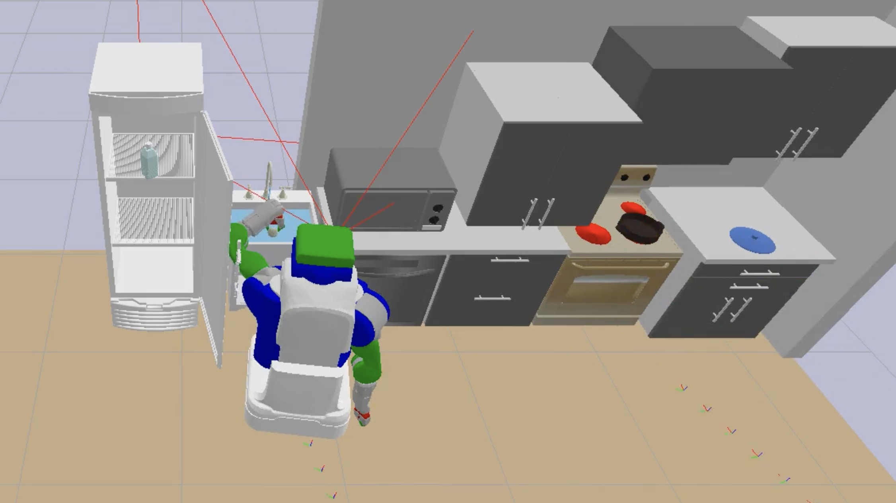

# Kitchen Worlds

A library of long-horizon Task-and-Motion-Planning (TAMP) problems in simulated kitchen and household scenes, as well as planning algorithms to solve them

- Procedural scene, goal, and multi-step trajectory generation (follow sections A -> B2 -> C)
  - procedurally generate scenes with rigid and articulated objects
  - visualize a scene in LISDF format (an extension to SDF that includes URDF)
  - solve a TAMP problem defined by a `scene.lisdf` and `problem.pddl` using existing `domain.pddl` and `stream.pddl` using PDDLStream
  - visualize the robot trajectory in pybullet
- Use a pretrained VLM (e.g. GPT-4v) to guide the planning process (follow section A -> B1)

</img>
</img>

<!--
<video autoplay loop muted playsinline width=100%>
  <source src="mp4/demo-cabbage.mp4" type="video/mp4">
</video>

<table class="multicol tightframes">
<tr>
<td width="33%">

</img>

</td>
<td width="33%">

</img>

</td>
<td width="33%">

</img>

</td>
</tr>
</table>
-->

## A. Installation

1. Clone the repo along with the submodules. It may take a few minutes. 

```shell
git clone git@github.com:Learning-and-Intelligent-Systems/kitchen-worlds.git --recursive
```

<details close>
<summary>In case the submodules are not up-to-date, checkout the most recent changes:
</summary>

<pre>
(cd pybullet_planning; git checkout master; git pull); \
  (cd pddlstream; git checkout caelan/diverse); \
  (cd assets/models; git checkout main); 
</pre>

</details>

2. Install dependencies. It may take a dozen minutes.
<!-- 
Install [graphviz](https://pygraphviz.github.io/documentation/latest/install.html).
-->
```shell
conda env create -f environment.yml
conda activate kitchen
## sudo apt-get install graphviz graphviz-dev  ## on Ubuntu
```

3. Build FastDownward, the task planner used by PDDLStream planner.
<!--
It has pre-requisites of cmake, first download the source tar from [site](https://cmake.org/download/).

<details close>
<summary>Expand Instructions Code</summary>

<pre>
sudo apt-get install build-essential libssl-dev
cd ~/Downloads
tar -zxvf cmake-3.31.0-rc1.tar.gz
cd cmake-3.31.0-rc1
./bootstrap
make
sudo make install
cmake --version
</pre>

</details>
-->
    

```shell
## sudo apt install cmake g++ git make python3  ## if not already installed
(cd pddlstream; ./downward/build.py)
```

4. Build IK solvers (If using mobile manipulators; skip this if you're only using the floating gripper).

* (If on Ubuntu, this one is better) TracIK for whole-body IK that solves for base, torso, and arm together

    ```shell
    sudo apt-get install libeigen3-dev liborocos-kdl-dev libkdl-parser-dev liburdfdom-dev libnlopt-dev libnlopt-cxx-dev swig
    pip install git+https://github.com/mjd3/tracikpy.git
    ```

* IKFast solver for arm planning (the default IK), which needs to be compiled for each robot type. Here's example for PR2:

    ```shell
    ## sudo apt-get install python-dev
    (cd pybullet_planning/pybullet_tools/ikfast/pr2; python setup.py)
    ```


### Test Installation

```shell 
conda activate kitchen
python examples/test_parse_lisdf.py
python examples/test_data_generation.py
```

---

## B. Tutorial

Here are some example scripts to help you understand the scene generation and task and motion planning tools. Once they are all working for you, we recommend you follow the next section to set up your own data generation pipeline with custom config files.

### 1. VLM-TAMP

See [vlm_tools/README.md](https://github.com/zt-yang/pybullet_planning/blob/master/vlm_tools/README.md) for more details.

### 2. Generate Worlds, Problems, and Plans

Generating data involves creating data folders that include scene layout `scene.lisdf`, `problem.pddl`, `plan.json`, and trajectory `commands.pkl`. It can be run without gui (faster) and can be run in parallel. Note that planning is not guaranteed to be return a solution within timeout, depending on the domain.

There are two scripts for collecting data. 

**Note that both script may result in a failed output folder or early stop of simulation because the problem can't be solved, e.g. when the world generation script failed to find an initial world configuration for randomly sampled objects. It's normal. Just run the script again.**

1) One is simpler, cleaner, and more adaptable for your tasks.    
   * It supports parallel data collection (change to `parallel: true; n_data: 10` in config yaml file).
   * Example configuration files are provided in [kitchen-worlds/pybullet_planning/data_generator/configs](https://github.com/zt-yang/pybullet_planning/blob/master/data_generator/configs/kitchen_full_feg.yaml).
   * **If `parallel: false; n_data: 1`, after a plan is generated, the console will prompt you to press Enter to visualize execution and prompt you to press again to exit the program.**

```shell
python examples/test_data_generation.py --config_name kitchen_full_pr2.yaml  ## PR2 with extended torso range
python examples/test_data_generation.py --config_name kitchen_full_feg.yaml  ## floating franka gripper
python examples/test_data_generation.py --config_name kitchen_full_feg.yaml --simulate  ## simulation mode broken as of Oct 17, 2024
python examples/test_data_generation.py --config_path {path/to/your/custom_data_config.yaml}
```

2) The other uses a more general set of classes and processes. 
   * It supports replaning and continuously interacting with the environment. 
   * It was used to procedually sample scene layouts and generate trajectory data for PIGINet [Sequence-Based Plan Feasibility Prediction for Efficient Task and Motion Planning](https://piginet.github.io/). 
   * Example configuration files are provided in [kitchen-worlds/pybullet_planning/cogarch_tools/configs](https://github.com/zt-yang/pybullet_planning/blob/master/cogarch_tools/configs/config_pigi.yaml).

```shell
python examples/test_data_generation_pigi.py  ## PR2 with extended torso range
```

Once a plan is generated and console stopped generated more logs, press Enter to visualize execution.

<!--
The outputs from both scripts will be one or multiple data folders that you can use as input to scripts for rendering images and videos described in the next section.

For example, a path may be `/home/yang/Documents/kitchen-worlds/outputs/test_feg_kitchen_mini/230214_205947`. You may also use the parent folder name `test_feg_kitchen_mini` as input to process all data folders for that task.

### Generate Images and Videos

Render images from camera poses given in `planning_config.json` of the data folders, which originates from the `camera_poses` field of data generation config files. The output images will be in their original data folders.

```shell
python examples/test_image_generation.py --task {path/to/your/task_name/data_dir}
python examples/test_image_generation.py --path {task_name}
```

Replay the generated trajectory in a given data path. Example configuration files are provided in [kitchen-worlds/pybullet_planning/pigi_tools/configs](https://github.com/zt-yang/pybullet_planning/blob/master/pigi_tools/configs/replay_rss.yaml). You can modify the options in config file to generate mp4, jpg, and gif.

```shell
python examples/test_replay_pigi_data.py --name replay_rss.yaml
python examples/test_replay_pigi_data.py --path {path/to/your/custom_replay_config.yaml}
```

### Customize Your Layout or Goals

Generate layout only:

```shell
python examples/test_world_builder.py -c kitchen_full_feg.yaml
```

-->

---

## C. Quick Start Your Scene or Trajectory Generation Pipeline

(Last tested 7 Oct, 2024)

We suggest putting your custom data generation code and config files inside a directory on the same level as `kitchen-worlds/pybullet_planning` in the project repo. For example, in `kitchen-worlds/your_project_folder`

### Step 1a) To generate PIGINet data

PIGINet data uses a specific procedure to generate scenes with randomized clutter. We recommend following 1b for your custom purposes.

The argument is name to your custom configuration file in [kitchen-worlds/your_project_folder/configs](https://github.com/Learning-and-Intelligent-Systems/kitchen-worlds/blob/master/your_project_folder/configs/config_generation_pigi.yaml):

Output will be in `outputs/{config.data.exp_subdir}/{timestamped_data_name}`.

```shell
## generates data folders with scene, problem, plan, trajectory
python your_project_folder/run_generation_pigi_custom.py

## render images, can run in parallel
python your_project_folder/render_images_custom.py --task custom_piginet_data --parallel
```

### Step 1b) To generate custom data (different world layout, goals, robots, etc.)

The argument is name to your custom configuration file in [kitchen-worlds/your_project_folder/configs](https://github.com/Learning-and-Intelligent-Systems/kitchen-worlds/blob/master/your_project_folder/configs/config_generation.yaml):

Data can be generated in parallel on CPU (set flag in config yaml file).

Output will be in `outputs/{config.data.out_dir}/{timestamped_data_names}`.

```shell
## generates data folders with scene, problem, plan, trajectory
python your_project_folder/run_generation_custom.py --config_name config_generation.yaml 
```


### Step 2) To render images for the generated scene

To train vision language models using generated data, we generate images for all runs in one output subdirectory associated for a task / data generation batch. 

For example, if data is generated using step 1b and default config is used, data will be generated in `outputs/custom_pr2_kitchen_full`, where `custom_pr2_kitchen_full` constitutes our task name here.

Some camera poses are defined in code, some in `outputs/{task_name}/{timestamped_data_name}/planning_config.json`. 

Output will be in each individual `outputs/{task_name}/{timestamped_data_name}/`

```shell 
python your_project_folder/render_images_custom.py --task {task_name}
```

### Step 3) To render video from successful planning runs

Replay the trajectory for review or rendering

Given path, for example, `timestamped_data_dir = 'custom_pr2_kitchen_full/241007_233942'` which contains the scene and plan files. 

The output `replay.mp4` will be saved in the same directory.

```shell
python your_project_folder/run_replay_custom.py -p {timestamped_data_dir}
```

Useful optional flags to this script:
* `--timestep 0.05` to set the simulation timestep, higher makes robot move slower and the video will have more frames.
* `--width 1440` sets the width of the video frame.
* `--height 1080` sets the height of the video frame.

---

## References

Please cite one of the following papers if you use this code in your research:

```text 
@misc{yang2024guidinglonghorizontaskmotion,
      title={Guiding Long-Horizon Task and Motion Planning with Vision Language Models}, 
      author={Zhutian Yang and Caelan Garrett and Dieter Fox and Tomás Lozano-Pérez and Leslie Pack Kaelbling},
      year={2024},
      eprint={2410.02193},
      archivePrefix={arXiv},
      primaryClass={cs.RO},
      url={https://arxiv.org/abs/2410.02193}, 
} 

@INPROCEEDINGS{yang2023piginet, 
    AUTHOR    = {Zhutian  Yang AND Caelan R Garrett AND Tomas Lozano-Perez AND Leslie Kaelbling AND Dieter Fox}, 
    TITLE     = {{Sequence-Based Plan Feasibility Prediction for Efficient Task and Motion Planning}}, 
    BOOKTITLE = {Proceedings of Robotics: Science and Systems}, 
    YEAR      = {2023}, 
    ADDRESS   = {Daegu, Republic of Korea}, 
    MONTH     = {July}, 
    DOI       = {10.15607/RSS.2023.XIX.061} 
} 
```

---

## Acknowledgements

The development is partially performed during internship at NVIDIA Research, Seattle Robotics Lab.

This repo works thanks for the tools provided by LIS lab members and alum:

* the [pybullet_tools](https://github.com/caelan/pybullet-planning/tree/master/pybullet_tools) package is an awesome set of tools developed by Caelan Garret. A forked version is included with my own helper functions.
* the [pddlstream](https://github.com/caelan/pddlstream) is a planning framework developed by Caelan Garret.
* the [lisdf](https://github.com/Learning-and-Intelligent-Systems/lisdf) package is an input/output specification for TAMP problems developed by William Shen, Nishanth Kumar, Aidan Curtis, and Jiayuan Mao.

All the object models and urdf files are downloaded for free from the following sources:

* most articulated object models are downloaded from [PartNet Mobility dataset](https://sapien.ucsd.edu/browse) (Mo, Kaichun, et al. "Partnet: A large-scale benchmark for fine-grained and hierarchical part-level 3d object understanding." *Proceedings of the IEEE/CVF conference on computer vision and pattern recognition*. 2019.)
* most kitchen object models are downloaded from [Free3D](https://free3d.com/3d-models/food).

