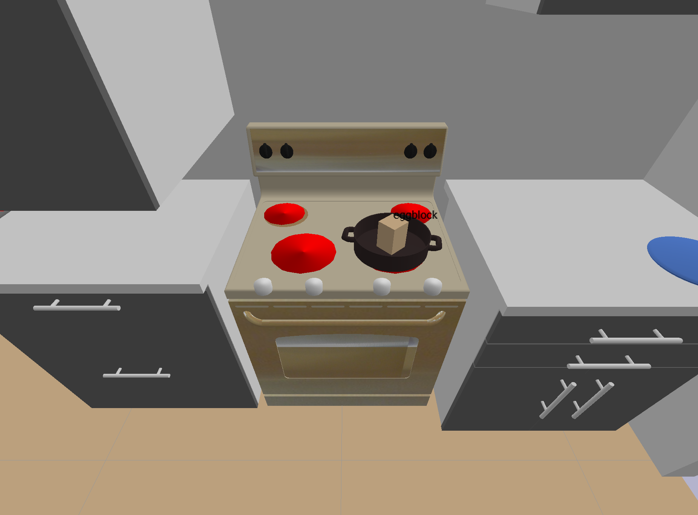

# LISDF = LIS extended version of SDF

The LISDF format has a few additional tags inside `<world></world>` compared to [SDF](http://sdformat.org/spec?ver=1.9&elem=sdf):

* add object and robot models with

```xml
<include>
    <uri>URDF_file</uri>
    <static>true/false</static>
    <pose>x y z r p y</pose>
    <scale> an integer to scale model .obj with original ratio</scale>
</include>
```

* describe camera pose in a way that's easy to export from PyBullet

```xml
<gui>
  <camera name="default_camera" definition_type="lookat">
    <xyz>3 6 3</xyz>
    <point_to>0 6 1</point_to>
  </camera>
</gui>
```
apart from what SDF originally supports

```xml
<gui>
  <camera name="default_camera" definition_type="pose">
    <pose>3 6 3 0 -2.15 0</pose>
  </camera>
</gui>
```

## Test Visualize LISDF

You may visualize your LISDF in PyBullet with the following code:

```
cd tests
python test_pybullet_lisdf -path path/to/lisdf
```

For example, running with the scene

```
python test_pybullet_lisdf -path assets/scenes/kitchen_counter.lisdf
```

results in Pybullet simulation below with the specified camera pose targeted at the pot.


